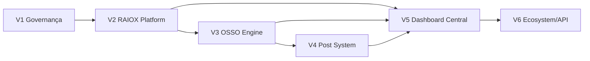

# Roadmap corporativo do ecossistema OSSO DIGITAL

## Princípios

- Fases são gates de maturidade, não datas prometidas.
- Produto posterior não deve bloquear a venda/operação válida do anterior.
- Integração só ocorre quando ambos os lados têm owner, contrato, segurança e observabilidade.
- Cada fase gera ADRs, checkpoints e revisão de riscos.

## V1 — Organização, documentação e padronização

**Outcome:** portfólio compreensível e execução repetível.

- [x] Master Plan RAIOX Platform.
- [x] ADRs arquiteturais RAIOX.
- [x] Arquitetura corporativa OSSO DIGITAL.
- [ ] Confirmar Product Owners e charters de todos os produtos/marcas.
- [ ] Inventariar repositórios, domínios, deploys, bancos, secrets e fornecedores.
- [ ] Classificar legado, backups e placeholders.
- [ ] Adotar templates de missão, ADR e checkpoint.
- [ ] Criar catálogo de packages e integrações.

**Gate de saída:** 100% dos produtos com owner, status, repo, dados, roadmap e riscos registrados.

## V2 — RAIOX Platform / OSSO Audit SaaS

**Outcome:** operação multiempresa de auditoria humana, segura e rastreável.

- Repositório independente e CI/CD.
- Auth, tenant, memberships, RLS e Storage privado.
- CRM mínimo, metodologia versionada e workflow humano.
- Evidências, achados, revisão e relatório imutável.
- LGPD, audit trail, observabilidade, backup/restore e beta controlado.
- IA permanece fora até workflow humano e baseline de qualidade.

**Gate de saída:** auditoria real completa sem editar runtime da Landing, com zero falha cross-tenant conhecida.

## V3 — OSSO Engine integrado

**Outcome:** automações seguras e reutilizáveis sem assumir systems of record.

- Product charter e auditoria do estado atual.
- Adapters e contratos versionados.
- Eventos/outbox/queues e idempotência.
- Agent registry, prompts, budgets, logs e kill switches.
- Integração inicial com RAIOX Platform em casos assistivos aprovados.
- Fallback humano e observabilidade ponta a ponta.

**Gate de saída:** automação pode ser desligada sem interromper workflow essencial e sem perda de dados.

## V4 — OSSO Post System multi-nicho

**Outcome:** operação editorial governada para diferentes marcas/segmentos.

- Auditoria do legado antes de reuso.
- Tenant/brand isolation.
- Calendário, briefing, aprovação e publicação.
- Integrações de canais por adapters.
- IA para drafts/classificação, nunca publicação sensível autônoma.
- Métricas editoriais normalizadas e consentidas.

**Gate de saída:** novo nicho entra por configuração/contrato, sem fork de código.

## V5 — Dashboard Central OSSO DIGITAL

**Outcome:** visão executiva do portfólio sem criar banco mestre indevido.

- Catálogo de produtos/tenants/health.
- SSO/federação quando justificada.
- Métricas agregadas por APIs/eventos/read models.
- Custos, SLOs, incidentes, billing e uso.
- Controles de acesso corporativos e trilha.
- Drill-down redireciona ao produto owner; não acessa banco diretamente.

**Gate de saída:** dashboard pode falhar sem derrubar produtos e não aumenta acesso a dados além do necessário.

## V6 — Marketplace, plugins, white label e API pública

**Outcome:** ecossistema extensível e monetizável com governança enterprise.

- Developer portal, OAuth/API keys e quotas.
- Plugin manifest, sandbox, permissions e review.
- Marketplace com versionamento, assinatura e revogação.
- White label sem forks.
- Partner model, revenue share e suporte.
- SSO/SCIM, data residency e compliance conforme mercado.
- Depreciação e compatibilidade pública.

**Gate de saída:** terceiros não podem escapar de tenant, permission scope, quota ou política de dados.

## Dependências entre fases

## Métricas corporativas por maturidade

| Pilar | V1 | V2–V3 | V4–V6 |
|---|---|---|---|
| Governança | % produtos com charter/owner | % ADR/checkpoint atualizado | compliance de parceiros/plugins |
| Engenharia | repos inventariados | lead time/change failure | reutilização e compatibilidade |
| Segurança | secrets/deploys mapeados | tenant isolation/incidentes | third-party/plugin risk |
| Produto | status/roadmap real | ativação/entrega/retenção | ecosystem adoption/revenue |
| Operação | runbooks existentes | SLO/MTTR/custo | cross-product reliability |

