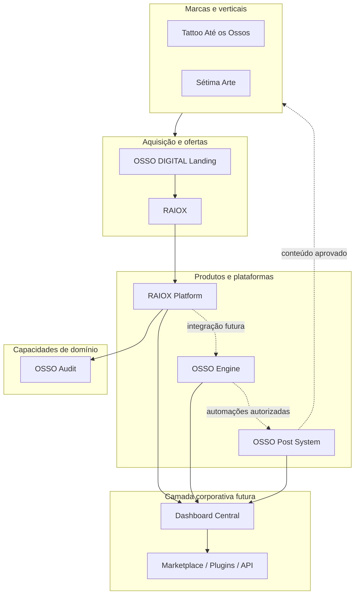

# OSSO DIGITAL — Arquitetura Corporativa Oficial

**Missão:** 003 — OSSO_DIGITAL_ARCHITECTURE  
**Data:** 02/07/2026  
**Status:** baseline corporativa documental  
**Aplicação:** todos os projetos atuais e futuros da OSSO DIGITAL  
**Regra:** este documento não autoriza implementação, migração, deploy ou alteração de runtime

## 1. Propósito

Esta arquitetura cria uma linguagem comum para produtos, marcas, plataformas, automações e canais da OSSO DIGITAL. O objetivo é reduzir duplicidade, permitir evolução independente e garantir que segurança, documentação, integração e operação sejam tratadas como capacidades corporativas, não improvisadas em cada projeto.

## 2. Princípios corporativos

1. **Produto antes de tecnologia:** cada runtime existe para uma responsabilidade e uma persona explícitas.
2. **Fronteiras fortes:** produtos não compartilham banco, secrets ou deploy implicitamente.
3. **Integração por contrato:** REST versionado, eventos versionados ou arquivos de intercâmbio aprovados; nunca acesso direto ao banco alheio.
4. **Polyrepo entre produtos, monorepo dentro do produto quando útil:** ciclos e riscos diferentes ficam separados; apps e packages do mesmo produto podem coabitar.
5. **Tenant first em SaaS:** `tenant_id`, RLS e testes de isolamento são obrigatórios.
6. **IA assistiva:** humano permanece responsável por decisão sensível e publicação.
7. **Documentação é parte do produto:** missão, ADR, checkpoint, changelog e roadmap acompanham decisões.
8. **Reuso sem cópia:** compartilhar packages/contratos versionados; não copiar módulos entre projetos.
9. **Observabilidade e segurança por padrão:** toda capacidade crítica nasce com logs, métricas, trilha, rollback e owner.
10. **Evolução por gates:** arquitetura aprovada não equivale a implementação ou produção aprovada.

## 3. Camadas do ecossistema

As setas representam relações futuras permitidas, não integrações existentes.

## 4. Papéis e fronteiras

| Elemento | Papel corporativo | É responsável por | Não é responsável por |
|---|---|---|---|
| RAIOX | oferta/diagnóstico comercial | aquisição, proposta de valor e entrega do diagnóstico | plataforma genérica ou automação operacional |
| RAIOX Platform | aplicação SaaS do ciclo de auditoria | tenants, clientes, workflow, evidências, revisão e relatório | motor corporativo de automação geral |
| OSSO Audit | bounded context de auditoria | metodologia, achados, score, recomendações e proveniência | CRM geral, publicação social ou marca comercial |
| OSSO Engine | motor de automações e agentes | orquestração operacional autorizada e integrações | ser sistema de registro da auditoria |
| OSSO Post System | produto de conteúdo/publicação | calendário, aprovação, distribuição e métricas editoriais | tomar decisão estratégica sem revisão humana |
| OSSO DIGITAL Landing | canal institucional corporativo | posicionamento, portfólio e aquisição da empresa | autenticação ou dados sensíveis de produto |
| Tattoo Até os Ossos | marca/vertical de domínio | contexto, audiência e operação próprios | core técnico compartilhado |
| Sétima Arte | marca/vertical de domínio | contexto, audiência e operação próprios | core técnico compartilhado |

## 5. Modelo de ownership

Todo produto deve possuir:

- Product Owner: problema, personas, prioridades e resultado.
- Tech Owner: arquitetura, qualidade, deploy e dívida técnica.
- Data Owner: finalidade, acesso, qualidade e retenção.
- Security/Privacy Owner: risco, incidentes e controles.
- Operations Owner: SLO, suporte, runbooks e continuidade.

Uma pessoa pode acumular papéis no início, mas os papéis não podem ficar implícitos.

## 6. Integrações futuras

### Padrões permitidos

- REST síncrono para consulta/comando com resposta imediata.
- Eventos assíncronos para fatos de domínio e desacoplamento.
- Webhooks assinados para providers e parceiros.
- Packages versionados para tipos, UI, telemetria ou SDK sem lógica de produto cruzada.
- Export/import documentado para transições temporárias.

### Padrões proibidos

- Leitura/escrita direta no banco de outro produto.
- Secret compartilhado sem owner, rotação e escopo.
- Copiar código e “sincronizar depois”.
- Evento sem versão, owner ou idempotência.
- Dependência de DOM/HTML de uma landing.
- Integração de produção não registrada em ADR e catálogo.

### Contrato mínimo de integração

`owner`, `consumer`, finalidade, dados, base legal, protocolo, autenticação, versão, SLO, rate limit, idempotência, retries, retenção, observabilidade, suporte, depreciação e fallback.

## 7. Dependências corporativas

| Classe | Dependência | Política |
|---|---|---|
| Identidade | Auth/OIDC futuro | produto mantém autorização local; federação exige ADR |
| Dados | PostgreSQL/Supabase quando adotado | banco por produto/ambiente; sem banco corporativo compartilhado implícito |
| IA | providers substituíveis | adapter, prompts versionados, DPA, budgets e revisão humana |
| Mensageria | queue por produto | envelopes estáveis e consumidores idempotentes |
| Pagamento | provider PCI | cartão nunca entra nos sistemas OSSO |
| Observabilidade | logs/metrics/traces | schema corporativo, redaction e correlação |
| Design | tokens e assets versionados | pacote oficial; landing congelada não é biblioteca |
| CI/CD | templates corporativos | cada produto possui pipeline e rollback próprios |

## 8. Estratégia de evolução

1. Padronizar documentação, ownership e inventário.
2. Construir RAIOX Platform/OSSO Audit sem acoplar Landing V1.
3. Integrar OSSO Engine somente por contratos aprovados.
4. Evoluir OSSO Post System para multi-nicho com revisão humana.
5. Criar dashboard central como leitor/orquestrador, não banco mestre universal.
6. Abrir marketplace, plugins, white label e API apenas após segurança e product-market fit.

Detalhamento: [ECOSYSTEM_ROADMAP.md](./ECOSYSTEM_ROADMAP.md).

## 9. Padrões obrigatórios

- [Engineering Standards](./ENGINEERING_STANDARDS.md)
- [SaaS Standards](./SAAS_STANDARDS.md)
- [Documentation Standards](./DOCUMENTATION_STANDARDS.md)
- [AI Agent Standards](./AI_AGENT_STANDARDS.md)
- [Repository Strategy](./REPOSITORY_STRATEGY.md)
- [ADR Template](./ADR_TEMPLATE.md)
- [Checkpoint Template](./CHECKPOINT_TEMPLATE.md)
- [Mission Template](./MISSION_TEMPLATE.md)

Conflitos entre padrões corporativos e necessidade de produto exigem ADR local explicitando motivação, risco, owner e prazo de revisão.

## 10. Riscos corporativos

| Risco | Impacto | Controle |
|---|---|---|
| produtos com nomes/responsabilidades sobrepostos | alto | Product Map e charters aprovados |
| duplicação de código | alto | packages versionados e ownership |
| banco/tenant compartilhado indevidamente | crítico | separação por produto + RLS local |
| automação/IA sem revisão | alto | AI Agent Standards e kill switch |
| documentação divergente do runtime | alto | checkpoints e CI documental |
| dependência de pessoa única | alto | runbooks, CODEOWNERS e handoff |
| legado importado tratado como produção | alto | diretórios de quarentena e auditoria antes de reuso |
| dashboard central virar monólito corporativo | alto | APIs/eventos; ownership permanece nos produtos |
| LGPD inconsistente entre produtos | crítico | mapa de dados e privacy owner por produto |

## 11. Governança

- Architecture Council: aprova padrões e ADRs cross-product.
- Product Review: valida fronteira, prioridade e roadmap.
- Security/Privacy Review: obrigatório para auth, dados, IA, billing e integrações.
- Release Gate: exige testes, observabilidade, rollback e checkpoint.
- Revisão desta arquitetura: semestral ou após mudança material.

## 12. Critérios de conformidade

Um projeto é aderente quando possui ownership, documentação mínima, repositório classificado, contratos de integração, ambientes segregados, segurança proporcional, testes, observabilidade, rollback e checkpoint atual. “Ainda não implementado” é estado válido; “implícito” não é.

