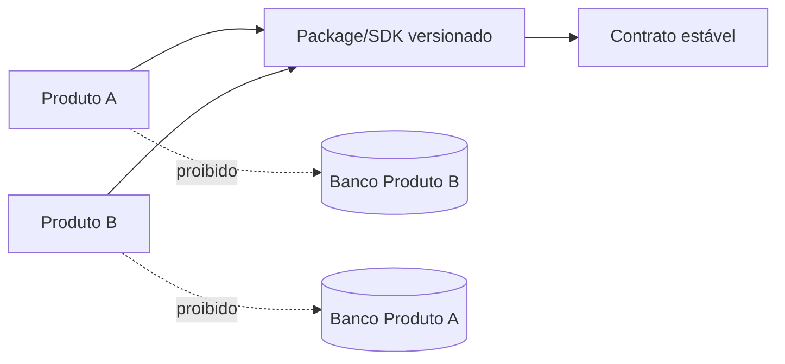

# Estratégia oficial de repositórios

## 1. Decisão corporativa

Adotar **polyrepo por produto** e **monorepo interno quando um produto possui múltiplos apps/packages com o mesmo ciclo de vida**.

Um repositório representa uma unidade de ownership, risco, release e rollback — não apenas uma pasta conveniente.

## 2. Quando usar repositório separado

Criar repositório próprio quando houver pelo menos um:

- produto/cliente com ciclo de release independente;
- secrets, dados ou threat model distintos;
- domínio/deploy/SLO próprios;
- equipe/ownership separado;
- necessidade de rollback independente;
- licença ou acesso diferentes;
- runtime público congelado que não pode herdar risco de uma plataforma.

Exemplo aprovado: `raiox-landing` separado de `raiox-platform`.

## 3. Quando usar monorepo

Usar monorepo dentro do mesmo produto quando:

- web, API e worker compartilham domínio e release coordenado;
- packages pertencem ao mesmo ownership;
- CI consegue detectar dependências e executar apenas o afetado;
- regras de import impedem acoplamento indevido;
- não há necessidade regulatória ou operacional de separação.

Monorepo não significa monólito sem fronteiras.

## 4. Quando criar packages

Package é apropriado para:

- contratos/schema/SDK versionados;
- design tokens e componentes acessíveis;
- observabilidade e configuração;
- autenticação/autorização técnica reutilizável;
- test-kit e tooling;
- adapters genuinamente comuns.

Não criar package para lógica específica de um produto só para “parecer reutilizável”. Extração acontece depois de dois usos reais compatíveis e owner definido.

## 5. Congelamento de landing

Congelar uma landing quando ela estiver publicada, validada e cumprir função comercial sem depender do produto autenticado. O frozen set deve ter:

- commit/hash de baseline;
- lista de arquivos protegidos;
- fluxo de change request;
- testes de regressão;
- deploy e rollback independentes;
- integração apenas por contrato público.

Landing congelada não vira pacote, template de backend ou submodule obrigatório.

## 6. Separação entre plataforma e landing

Separar sempre que a plataforma introduzir autenticação, banco, dados sensíveis, billing, workers ou SLO distinto. É proibido colocar service keys, sessão autenticada ou lógica de tenant na landing pública por conveniência.

## 7. Como evitar duplicidade

1. Consultar catálogo corporativo antes de criar módulo.
2. Identificar owner e consumidores reais.
3. Reusar contrato/package versionado, não copiar diretório.
4. Se copiar temporariamente, registrar dívida, motivo e prazo — sem alegar reuso.
5. Proibir shared database como atalho.
6. Manter changelog e SemVer de packages compartilhados.

## 8. Compartilhamento de módulos



Cada consumidor fixa versão. Breaking change exige versão maior, migration guide e janela de adoção.

## 9. Dependências entre produtos

Registrar em `docs/dependencies.md` ou equivalente:

| Campo | Obrigatório |
|---|---|
| provider/consumer | sim |
| capacidade/contrato | sim |
| owner técnico e produto | sim |
| versão/protocolo | sim |
| dados/classificação/base legal | sim |
| autenticação e secrets | sim |
| SLO/rate limit/retry | sim |
| observabilidade e runbook | sim |
| depreciação/fallback | sim |

## 10. Estrutura mínima de repositório de produto

```text
project/
├── .github/
├── apps/                 # quando monorepo
├── packages/             # quando comprovadamente compartilhados
├── docs/
│   ├── adr/
│   ├── architecture/
│   ├── operations/
│   └── security/
├── checkpoints/
├── README.md
├── CHANGELOG.md
├── ROADMAP.md
├── VERSION.md
├── RELEASE_NOTES.md
├── CHECKPOINTS.md
└── SECURITY.md           # quando há runtime/dados
```

## 11. Governança de legado

Conteúdo em `IMPORTADOS`, `BACKUP`, `OLD`, `LEGACY` ou similar é não confiável por padrão. Reuso exige inventário, licença, secret scan, segurança, testes, owner e ADR. Nunca promover diretamente para produção.

## 12. Critérios de aceite

- Um produto possui um system of record e owner claros.
- Nenhuma integração depende de banco/DOM alheio.
- Packages possuem consumidores, SemVer e changelog.
- Landings congeladas têm baseline verificável.
- Dependências cross-product estão documentadas e monitoradas.

