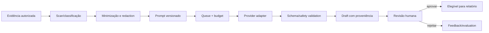

# ADR-008 — Pipeline de IA assistiva

**Status:** Accepted  
**Data:** 02/07/2026  
**Owners:** Product + Security + Audit  
**Decisão Foundation relacionada:** D-007 e D-008

## Contexto

Evidências podem conter dados pessoais, segredos comerciais e instruções hostis. Modelos podem alucinar, sofrer prompt injection, variar entre versões e produzir recomendações sem base. Ao mesmo tempo, IA pode reduzir tempo de análise quando usada como assistência rastreável.

## Decisão

Adotar pipeline de IA assíncrono, provider-agnostic e human-in-the-loop:

Casos inicialmente permitidos na V3: extração estruturada, classificação, sugestão de achados, recomendação e score. Todos produzem drafts. IA não muda estado crítico, aprova, publica, envia ao cliente ou executa implantação.

## Proveniência obrigatória

Cada execução registra `tenant_id`, auditoria, finalidade, prompt/version/hash, provider/modelo, entradas e redaction version, timestamps, tokens/custo, output hash, validação, reviewer e decisão humana.

## Isolamento e privacidade

- Dados de tenants nunca são combinados no mesmo prompt por padrão.
- Treino/fine-tuning com dados de cliente é proibido sem opt-in contratual separado e nova decisão.
- Provider deve oferecer condições de retenção e uso compatíveis com contrato/DPA.
- PII é minimizada/redigida antes do envio quando possível.
- Payload bruto tem acesso e retenção menores que o relatório aprovado.

## Alternativas consideradas

### IA síncrona na request do usuário

Rejeitada: latência, timeout, custo e indisponibilidade prejudicam workflow.

### Um provider/modelo diretamente no domínio

Rejeitada: cria lock-in e mistura contrato externo com regra interna.

### Publicação autônoma com confidence threshold

Rejeitada: confiança do modelo não substitui evidência, metodologia e responsabilidade humana.

### Introduzir IA já na V2

Rejeitada: primeiro deve existir workflow humano, evidência, revisão e baseline de qualidade.

## Segurança contra conteúdo hostil

- Evidência é dado não confiável, nunca instrução de sistema.
- Ferramentas, browsing e execução de código desligados por padrão.
- Prompt separa claramente policy, tarefa e conteúdo.
- Output aceita somente schema allowlisted; campos extras são rejeitados.
- URLs/comandos gerados não são executados automaticamente.
- Egress e secrets do worker seguem menor privilégio.

## Avaliação e promoção

Uma combinação prompt/modelo só chega à produção após:

- golden set versionado e representativo;
- métricas de groundedness, precisão, omissão, PII e custo;
- testes de prompt injection e conteúdo adversarial;
- revisão do auditor de domínio;
- thresholds aprovados e comparação contra baseline humana;
- feature flag, canary, rollback e kill switch.

## Consequências

- Maior rastreabilidade e segurança, com custo de revisão humana.
- Provider pode ser trocado por adapter, mas outputs precisam de normalização.
- Custo/latência ficam visíveis por tenant e finalidade.
- Feedback humano vira dado de avaliação, não treinamento automático.

## Guardrails

- Budget e rate limit por tenant/finalidade.
- Kill switch global, por tenant, metodologia, provider e modelo.
- Fallback manual sempre disponível.
- Sem prompt/output sensível em logs gerais.
- Sem benchmark cross-tenant até governança V4.
- Mudança de provider/modelo/prompt exige avaliação e versão.

## Critérios de aceite futuro

- 100% dos outputs visíveis ao cliente têm aprovação humana.
- Toda sugestão cita evidência autorizada.
- Testes bloqueiam vazamento conhecido de PII e schema inválido.
- Custo, latência, erro e taxa de aprovação são observáveis.
- Desligar IA não impede conclusão manual da auditoria.

