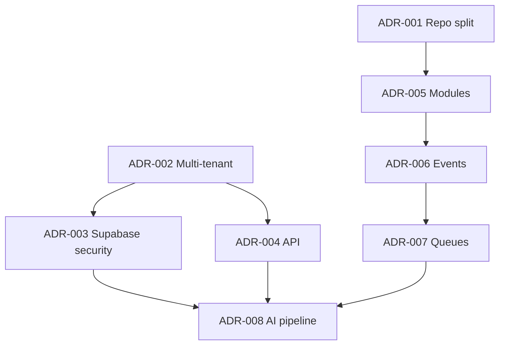

# ADR Index — RAIOX PLATFORM

## Convenção

Architecture Decision Records são imutáveis depois de aceitos, salvo correção editorial que não altere a decisão. Mudanças materiais criam novo ADR e marcam o anterior como `Superseded`.

Status permitidos: `Proposed`, `Accepted`, `Deprecated`, `Superseded`, `Rejected`.

## Índice

| ID | Título | Status | Data | Owners |
|---|---|---|---|---|
| [ADR-001](./ADR_001_REPOSITORY_SPLIT.md) | Separação entre Landing e Platform | Accepted | 02/07/2026 | Product + Tech |
| [ADR-002](./ADR_002_MULTI_TENANT.md) | Modelo multi-tenant compartilhado | Accepted | 02/07/2026 | Tech + Security |
| [ADR-003](./ADR_003_SUPABASE_SECURITY.md) | Baseline de segurança Supabase | Accepted | 02/07/2026 | Security + Tech |
| [ADR-004](./ADR_004_API_VERSIONING.md) | Versionamento e governança da API | Accepted | 02/07/2026 | Tech + Product |
| [ADR-005](./ADR_005_MODULE_BOUNDARIES.md) | Fronteiras do monólito modular | Accepted | 02/07/2026 | Tech |
| [ADR-006](./ADR_006_EVENT_ARCHITECTURE.md) | Arquitetura de eventos e outbox | Accepted | 02/07/2026 | Tech + Operations |
| [ADR-007](./ADR_007_QUEUE_SYSTEM.md) | Sistema inicial de filas | Accepted | 02/07/2026 | Tech + Operations |
| [ADR-008](./ADR_008_AI_PIPELINE.md) | Pipeline de IA assistiva | Accepted | 02/07/2026 | Product + Security + Audit |

## Dependências entre decisões

## ADRs futuros previstos

- ADR-009: runtime, framework e estratégia de renderização.
- ADR-010: estratégia de ambientes, regiões, backup e disaster recovery.
- ADR-011: metodologia e versionamento do score.
- ADR-012: renderização e assinatura de relatórios.
- ADR-013: billing provider e reconciliação.
- ADR-014: analytics e consentimento.

Esses itens não estão aprovados nesta missão.

