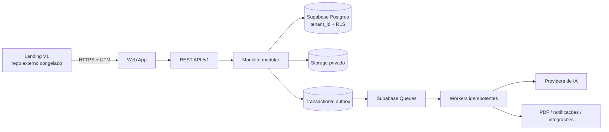

# Decisões arquiteturais consolidadas — RAIOX PLATFORM

**Produto técnico:** OSSO AUDIT  
**Missão:** 002 — Architecture Decisions  
**Versão documental:** `0.2.0-architecture`  
**Data de aprovação arquitetural:** 02/07/2026  
**Status:** aprovado como baseline; não autoriza implementação ou deploy

## 1. Escopo da aprovação

Esta aprovação encerra escolhas estruturais necessárias para orientar o RAIOX PLATFORM. Ela não aprova lógica de score, prompts, fornecedores contratados, preços finais, tratamento jurídico específico, migrations, código ou infraestrutura de produção.

A Landing RAIOX V1 continua como dependência externa congelada no commit `b7984a2`. Nenhum ADR permite alterar seu runtime.

## 2. Registro consolidado

| ADR | Decisão | Status | Efeito vinculante |
|---|---|---|---|
| [ADR-001](./ADR_001_REPOSITORY_SPLIT.md) | Separar Landing e Platform em repositórios independentes | Aceito | nenhum código V1 será copiado para a plataforma |
| [ADR-002](./ADR_002_MULTI_TENANT.md) | Banco/schema compartilhados com `tenant_id` e RLS | Aceito | isolamento multiempresa é requisito P0 |
| [ADR-003](./ADR_003_SUPABASE_SECURITY.md) | Supabase com defense in depth | Aceito | Auth, RLS, Storage policies e secrets server-side |
| [ADR-004](./ADR_004_API_VERSIONING.md) | REST contract-first versionado no path | Aceito | contrato público começa em `/v1` |
| [ADR-005](./ADR_005_MODULE_BOUNDARIES.md) | Monólito modular em monorepo | Aceito | módulos não acessam dados alheios diretamente |
| [ADR-006](./ADR_006_EVENT_ARCHITECTURE.md) | Eventos de domínio + outbox; sem event sourcing | Aceito | entrega at-least-once e consumidores idempotentes |
| [ADR-007](./ADR_007_QUEUE_SYSTEM.md) | Supabase Queues como fila inicial | Aceito | jobs pesados são assíncronos, duráveis e observáveis |
| [ADR-008](./ADR_008_AI_PIPELINE.md) | IA assistiva, assíncrona e human-in-the-loop | Aceito | IA nunca aprova ou publica autonomamente |

## 3. Arquitetura resultante

## 4. Regras invariantes

1. Landing e Platform têm repositórios, deploys, domínios e releases independentes.
2. Toda tabela de negócio possui `tenant_id NOT NULL`, FK e índice; exceções globais são explícitas e privadas.
3. `service_role`, secret keys e credenciais de providers nunca chegam ao navegador.
4. A API é o contrato do produto; o schema do banco não é interface pública.
5. O domínio não depende de framework, Supabase, fila ou provider.
6. Transações gravam estado e outbox atomicamente quando um evento externo é necessário.
7. Eventos e jobs podem ser entregues mais de uma vez; consumidores devem ser idempotentes.
8. Evidência, metodologia, proveniência e revisão humana antecedem score e publicação.
9. Relatórios publicados são snapshots imutáveis.
10. Nenhum ADR autoriza criação de código nesta missão.

## 5. Decisões ainda abertas

As decisões abaixo serão registradas em ADRs próprios somente quando houver evidência suficiente:

| Tema | Momento | Gate |
|---|---|---|
| Versões exatas de runtime/framework | início da Missão 003 | compatibilidade e suporte |
| Região/plano Supabase e política de backup | antes de ambiente staging | jurídico, RPO/RTO e custo |
| Provider de IA/modelos | antes da V3 | DPA, retenção, qualidade e custo |
| Provider de pagamento | antes do billing V3 | Brasil, webhook, fiscal e taxas |
| Renderizador PDF | durante V2 | fidelidade, acessibilidade e escala |
| Metodologia e pesos de score | antes do módulo de score | validação de domínio |
| Matriz final de retenção | antes do beta | jurídico e privacidade |
| Preços SaaS | após design partners | unit economics e mercado |

## 6. Relação com D-001 a D-010 da Foundation

| Decisão Foundation | Destino nesta missão |
|---|---|
| D-001 repositório | formalizada no ADR-001 |
| D-002 domínios | princípio aprovado; DNS/deploy permanece futuro |
| D-003 tenancy | formalizada no ADR-002 |
| D-004 Auth | formalizada no ADR-003 |
| D-005 API | formalizada no ADR-004 |
| D-006 relatório imutável | preservada como invariante dos módulos |
| D-007 IA assistiva | formalizada no ADR-008 |
| D-008 workflow humano antes de IA | preservada no roadmap V2/V3 |
| D-009 monetização | hipótese mantida; preço SaaS continua aberto |
| D-010 retenção | arquitetura preparada; prazos finais continuam gate jurídico |

## 7. Processo para alterar uma decisão

1. Criar novo ADR com contexto e evidências.
2. Marcar o ADR anterior como `Superseded` sem reescrever seu histórico.
3. Avaliar impacto em segurança, dados, API, custos, cronograma e Landing V1.
4. Obter aprovação dos owners indicados.
5. Atualizar índice, Master Plan, roadmap, release notes e checkpoint.

Mudança incompatível sem ADR é violação arquitetural.

## 8. Gate de saída

O `CHECKPOINT_002_ARCHITECTURE_APPROVED` é válido quando:

- os oito ADRs estão `Accepted`;
- links e referências são consistentes;
- a Landing V1 permanece fora do diff;
- não existe código, migration ou configuração de deploy nova;
- riscos e decisões abertas estão explícitos;
- a Missão 003 permanece separada e não iniciada.

