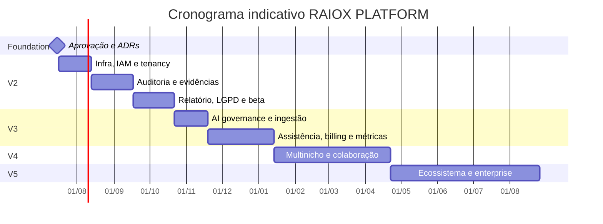

# Backlog priorizado, estratégia comercial e cronograma V2–V5

## 1. Regras de priorização

- `P0`: necessário para isolamento, segurança, entrega básica ou obrigação legal.
- `P1`: necessário para operação comercial estável.
- `P2`: ganho de escala/experiência após validação.
- `P3`: expansão opcional.
- Nenhum item de IA supera um gate de segurança, evidência, revisão humana ou metodologia.
- Cada épico exige owner, ADRs, critérios de aceite, telemetria e runbook antes de `done`.

## 2. V2 — Operação digital segura

**Meta:** substituir planilhas e edição manual do relatório por workflow autenticado, mantendo análise e decisão humanas.  
**Janela proposta:** 12–16 semanas após aprovação da Foundation.

| ID | Pri. | Épico | Entrega | Critério de aceite resumido |
|---|---:|---|---|---|
| V2-01 | P0 | Repositório e CI | monorepo, ambientes, quality gates | build reproduzível e PR protegido |
| V2-02 | P0 | Supabase baseline | projetos, migrations e testes RLS | zero acesso cross-tenant |
| V2-03 | P0 | Auth e tenancy | login, tenants, convites, roles, MFA alto risco | revogação e menor privilégio testados |
| V2-04 | P0 | CRM mínimo | leads, accounts, contacts | dados segregados e auditáveis |
| V2-05 | P0 | Metodologia v1 | dimensões/perguntas versionadas | publicação imutável aprovada |
| V2-06 | P0 | Workflow de auditoria | estados, atribuição, SLA | transições e trilha completas |
| V2-07 | P0 | Evidências | upload privado, hash, scan, retenção | acesso assinado e auditado |
| V2-08 | P0 | Achados e score humano | drafts, justificativa, revisão | nenhum score sem evidência/metodologia |
| V2-09 | P0 | Relatório versionado | snapshot, aprovação e portal | versão publicada imutável |
| V2-10 | P1 | PDF assíncrono | export em fila | idempotência e download privado |
| V2-11 | P0 | LGPD foundation | consent/DSR/retention/audit events | fluxo demonstrado em staging |
| V2-12 | P0 | Observabilidade | logs, métricas, alertas e runbooks | SLO monitorado e alerta testado |
| V2-13 | P1 | Billing assistido | plano/entitlement + reconciliação manual | nenhum dado de cartão armazenado |
| V2-14 | P1 | Beta controlado | 3–5 tenants design partners | sucesso e incidentes medidos |

### Critério de saída V2

- Uma auditoria real percorre criação→coleta→análise humana→revisão→publicação→PDF sem editar `scripts/report.js`.
- Tenant isolation, backup restore, incidente simulado e exclusão LGPD passam.
- Landing V1 continua inalterada e aponta para fluxo novo apenas após aprovação explícita.

## 3. V3 — Inteligência assistida e monetização

**Meta:** reduzir tempo operacional com IA revisada, pagamentos e métricas de produto.  
**Janela proposta:** 10–14 semanas após estabilidade V2.

| ID | Pri. | Épico | Entrega | Critério de aceite resumido |
|---|---:|---|---|---|
| V3-01 | P0 | AI governance | registry de prompt/modelo, kill switch, custo | toda execução rastreável |
| V3-02 | P0 | Ingestão/redaction | extração e minimização | golden set sem vazamento conhecido |
| V3-03 | P1 | Sugestão de achados | drafts citando evidência | precisão e aprovação dentro da meta |
| V3-04 | P1 | Sugestão de recomendação | proposta editável | 100% revisão humana |
| V3-05 | P1 | Score assistido | sugestão explicável | nunca publica automaticamente |
| V3-06 | P0 | Pagamentos | checkout hospedado + webhooks | reconciliação idempotente |
| V3-07 | P1 | Usage billing | ledger e limites | cobrança reproduzível |
| V3-08 | P1 | Dashboard operacional | SLA, capacidade, conversão e custo | métricas reconciliadas |
| V3-09 | P2 | Notificações | e-mail e templates versionados | preferências e opt-out respeitados |
| V3-10 | P0 | AI evaluation | dataset, regressão e red team | promoção bloqueada por qualidade |

### Critério de saída V3

- IA reduz tempo mediano de análise sem queda de qualidade aprovada.
- Custo por auditoria e margem são observáveis.
- Billing, estorno, inadimplência e webhook replay estão testados.

## 4. V4 — Multinicho e colaboração

**Meta:** operar metodologias por segmento e equipes maiores.  
**Janela proposta:** 12–16 semanas após V3.

| ID | Pri. | Épico | Entrega |
|---|---:|---|---|
| V4-01 | P0 | Methodology studio | criação, validação e promoção de versões |
| V4-02 | P0 | Segment isolation | critérios/prompt/benchmark por nicho |
| V4-03 | P1 | Benchmarks | agregação com amostra e privacidade mínimas |
| V4-04 | P1 | Colaboração | comentários, menções, tarefas e revisão dupla |
| V4-05 | P1 | Integrações | CRM, mensageria e importação por adapters |
| V4-06 | P2 | SSO/SAML | autenticação empresarial conforme demanda |
| V4-07 | P1 | White-label limitado | marca por tenant sem fork de código |
| V4-08 | P1 | Portfolio dashboard | múltiplas contas e tendências |
| V4-09 | P0 | Data governance scale | anonimização e benchmark controls |

### Critério de saída V4

- Novo nicho é adicionado por metodologia versionada, sem branch ou tabela específica.
- Benchmark não é exibido abaixo do limiar de amostra aprovado.
- Integração defeituosa não bloqueia auditoria manual.

## 5. V5 — Plataforma e ecossistema

**Meta:** disponibilizar capacidades do OSSO AUDIT para parceiros e operações enterprise.  
**Janela proposta:** 16+ semanas após product-market fit V4.

| ID | Pri. | Épico | Entrega |
|---|---:|---|---|
| V5-01 | P0 | Public API | OAuth/API keys, quotas e developer portal |
| V5-02 | P1 | Partner model | organizações parceiras e subtenancy aprovada |
| V5-03 | P1 | Template marketplace | metodologias certificadas e governadas |
| V5-04 | P1 | Enterprise controls | SCIM, SSO, políticas e data residency conforme viabilidade |
| V5-05 | P2 | Advanced analytics | cohort, impacto e previsão com governança |
| V5-06 | P2 | Implementation network | encaminhamento e acompanhamento de implantação |
| V5-07 | P0 | Compliance maturity | controles, evidências e auditoria externa conforme mercado |

## 6. Cronograma por gates

Datas são indicativas e dependem da aprovação da Foundation, equipe dedicada, contratos e resultados de cada gate. Não constituem compromisso comercial.

## 7. Estratégia comercial

### Segmentos iniciais

1. Pequenas empresas com venda por WhatsApp e operação pouco mensurada.
2. Agências/consultorias que desejam padronizar diagnósticos.
3. Franquias ou grupos com múltiplas unidades, somente após V4.

### Jornada de oferta

| Etapa | Produto | Objetivo |
|---|---|---|
| Entrada | conteúdo + relatório demo V1 | educar e gerar confiança |
| Diagnóstico | RAIOX manual/assistido | monetizar clareza e qualificar implantação |
| Continuidade | acompanhamento do plano | recorrência e prova de impacto |
| Implantação | projeto OSSO DIGITAL ou parceiro | executar prioridades aprovadas |
| Plataforma | assinatura por tenant/equipe | escalar operação repetível |

### Posicionamento

O RAIOX não promete vendas; entrega evidência, priorização e um plano auditável. A mensagem comercial deve separar claramente diagnóstico, recomendação, implantação e resultado dependente de execução.

## 8. Monetização proposta para validação

### V2

- Manter oferta V1 de **R$ 197** como aquisição/manual, sem codificá-la como preço definitivo da plataforma.
- Beta com design partners por pacote de auditorias e feedback estruturado.
- Cobrança assistida; entitlement gerenciado na plataforma.

### V3

- Plano `Starter`: mensalidade base + franquia de auditorias.
- Plano `Pro`: usuários, auditorias e IA ampliados.
- Add-ons: auditoria extra, export premium, armazenamento adicional e uso de IA.
- Serviço separado: revisão/execução pela OSSO DIGITAL.

### V4–V5

- Plano `Agency`: portfólio, white-label e colaboração.
- Plano `Enterprise`: SSO, controles, SLA e contrato anual.
- API/partner: platform fee + uso, com mínimo mensal.

Preços finais dependem de pesquisa, custo de aquisição, suporte, infraestrutura, tokens, impostos, inadimplência e margem-alvo. Nenhum valor além da oferta V1 é aprovado nesta Foundation.

## 9. Métricas e unit economics

| Pilar | Métrica |
|---|---|
| Aquisição | visita→lead, lead→qualificado, CAC por canal |
| Ativação | tenant que publica primeira auditoria em 14 dias |
| Eficiência | tempo de coleta, análise, revisão e entrega |
| Qualidade | rejeição do reviewer, correções pós-publicação, NPS/CSAT |
| IA | taxa de aprovação, ganho de tempo, custo por auditoria |
| Receita | MRR, ARPA, receita por auditoria, attach de implantação |
| Retenção | logo churn, revenue churn, auditorias/tenant/mês |
| Margem | receita menos infra, IA, pagamento, suporte e entrega humana |
| Risco | incidentes, DSR em atraso, falhas cross-tenant, chargebacks |

## 10. Definition of Ready

Uma história só entra em desenvolvimento com:

- problema, persona e valor definidos;
- owner e prioridade;
- contrato de dados/API e ameaça analisados;
- critérios de aceite e casos negativos;
- impacto LGPD e retenção;
- telemetria, feature flag e rollback;
- dependências e dados de teste identificados.

## 11. Definition of Done

- código revisado e testes verdes;
- migrations/policies revisadas e tenant isolation provado;
- documentação/OpenAPI/changelog atualizados;
- métricas, logs, alertas e runbook disponíveis;
- acessibilidade e segurança verificadas;
- privacy/security review quando aplicável;
- deploy em staging e evidência de aceite;
- sem finding crítico/alto aberto;
- aprovação do product owner.

## 12. Dependências externas

| Dependência | Decisão necessária | Plano de contingência |
|---|---|---|
| Supabase | região, plano, backup, DPA | export/restore e adapters claros |
| Provider de IA | privacidade, retenção, custo, modelo | multi-provider + fallback manual |
| Pagamentos | Brasil, recorrência, webhooks, taxas | cobrança manual temporária |
| E-mail | entregabilidade e DPA | provider alternativo |
| WhatsApp | API oficial e templates | e-mail + atendimento humano |
| PDF | fidelidade, fonte e escala | render alternativo/manual |
| Observabilidade | custo, região e PII controls | logs/metrics básicos exportáveis |
| Jurídico/privacidade | documentos e papéis | beta fechado sem dados sensíveis até aprovação |

