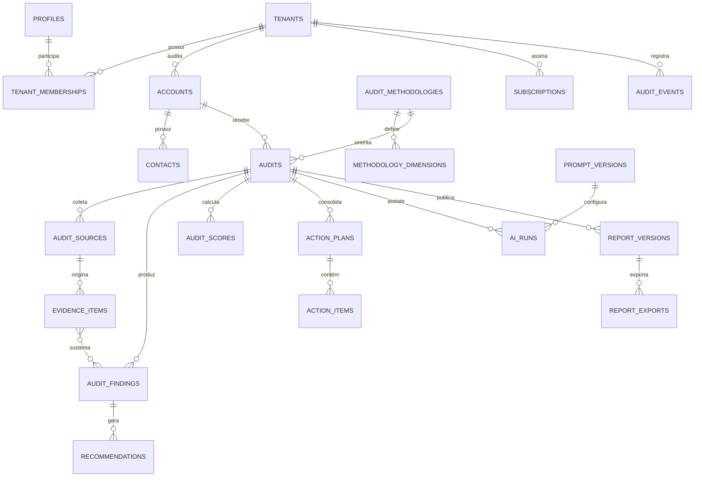

# Modelagem Supabase multiempresa

## 1. Convenções obrigatórias

- Chaves primárias: UUID v7 quando suportado pela versão adotada; UUID v4 como fallback.
- Todas as tabelas de negócio incluem `tenant_id uuid NOT NULL` com FK para `tenants.id`.
- Campos comuns: `id`, `tenant_id`, `created_at`, `created_by`, `updated_at`, `updated_by`, `version`.
- Exclusão lógica apenas onde há necessidade de restauração; dados sujeitos à LGPD usam anonimização/exclusão controlada.
- Datas em UTC (`timestamptz`); moeda em inteiro de centavos + código ISO 4217.
- Conteúdo de IA nunca sobrescreve autoria humana; versões e proveniência são preservadas.
- RLS habilitada e testada em toda tabela exposta. Nenhuma tabela nova entra em produção sem política e teste negativo cross-tenant.
- `service_role` existe somente em worker/Edge Function controlada, nunca em navegador.

## 2. Relações principais

## 3. Catálogo de entidades

### 3.1 Identidade e tenancy

| Tabela | Finalidade | Campos específicos essenciais |
|---|---|---|
| `tenants` | empresa contratante da plataforma | `legal_name`, `trade_name`, `slug`, `status`, `timezone`, `locale`, `data_region`, `settings_json` |
| `profiles` | extensão de `auth.users` | `auth_user_id`, `display_name`, `phone`, `locale`, `last_active_at` |
| `tenant_memberships` | vínculo usuário–tenant | `profile_id`, `role`, `status`, `joined_at`; unique `(tenant_id, profile_id)` |
| `tenant_invitations` | convite com expiração | `email_normalized`, `role`, `token_hash`, `expires_at`, `accepted_at`, `revoked_at` |
| `platform_roles` | privilégio operacional OSSO | `profile_id`, `role`, `reason`, `expires_at`; fora do escopo de tenant comum |

`profiles` é global e não carrega `tenant_id`; não contém dado de negócio. `platform_roles` fica em schema privado e nunca é exposto por REST genérico.

### 3.2 Clientes e relacionamento

| Tabela | Finalidade | Campos específicos essenciais |
|---|---|---|
| `accounts` | empresa auditada | `name`, `legal_name`, `document_hash`, `segment_id`, `website_url`, `status`, `owner_membership_id` |
| `contacts` | pessoas da empresa auditada | `account_id`, `name`, `email_ciphertext`, `phone_ciphertext`, `role`, `is_primary`, `lawful_basis` |
| `leads` | entrada comercial | `source`, `campaign`, `status`, `account_id`, `assigned_to`, `qualified_at`, `lost_reason` |
| `activities` | histórico comercial | `account_id`, `lead_id`, `type`, `occurred_at`, `summary`, `actor_membership_id` |

Documentos fiscais, telefones e e-mails pesquisáveis usam hash normalizado para deduplicação e ciphertext para exibição, quando a arquitetura de chaves for aprovada.

### 3.3 Metodologia

| Tabela | Finalidade | Campos específicos essenciais |
|---|---|---|
| `segments` | nichos suportados | `code`, `name`, `status` |
| `audit_methodologies` | versão imutável da metodologia | `name`, `semantic_version`, `segment_id`, `status`, `published_at`, `supersedes_id` |
| `methodology_dimensions` | dimensões avaliadas | `methodology_id`, `code`, `name`, `description`, `weight`, `sort_order`, `scoring_rules_json` |
| `methodology_questions` | roteiro/coleta | `dimension_id`, `code`, `prompt`, `response_type`, `required`, `sort_order` |
| `benchmark_sets` | benchmark agregado aprovado | `segment_id`, `methodology_id`, `period`, `sample_size`, `status` |

Metodologias publicadas não são editadas. Alterações criam nova versão. `scoring_rules_json` representa configuração aprovada, não permite código executável.

### 3.4 Auditoria e evidência

| Tabela | Finalidade | Campos específicos essenciais |
|---|---|---|
| `audits` | agregado principal | `account_id`, `methodology_id`, `status`, `assigned_auditor_id`, `reviewer_id`, `started_at`, `due_at`, `completed_at` |
| `audit_status_history` | transições rastreáveis | `audit_id`, `from_status`, `to_status`, `reason`, `actor_membership_id` |
| `audit_sources` | canal ou documento coletado | `audit_id`, `source_type`, `label`, `source_url`, `collection_status`, `collected_at` |
| `evidence_items` | evidência unitária | `audit_id`, `source_id`, `storage_object_id`, `content_excerpt`, `content_hash`, `classification`, `captured_at`, `retention_until` |
| `evidence_access_log` | acesso a material sensível | `evidence_id`, `actor_id`, `action`, `purpose`, `occurred_at` |
| `audit_responses` | respostas estruturadas | `audit_id`, `question_id`, `value_json`, `evidence_id`, `answered_by` |

Buckets privados usam caminho lógico `{tenant_id}/{account_id}/{audit_id}/{object_id}`. O caminho não concede autorização; RLS e URLs assinadas de curta duração concedem.

### 3.5 Achados, score e plano

| Tabela | Finalidade | Campos específicos essenciais |
|---|---|---|
| `audit_findings` | problema/oportunidade sustentado | `audit_id`, `dimension_id`, `title`, `description`, `impact`, `severity`, `confidence`, `origin`, `review_status` |
| `finding_evidence` | N:N achado–evidência | `finding_id`, `evidence_id`, `relevance_note` |
| `audit_scores` | score versionado | `audit_id`, `dimension_id nullable`, `value`, `rationale`, `methodology_version`, `calculated_by`, `approved_by` |
| `recommendations` | recomendação revisável | `finding_id`, `title`, `description`, `priority`, `impact`, `effort`, `origin`, `review_status` |
| `action_plans` | plano por auditoria | `audit_id`, `title`, `status`, `horizon_days`, `published_at` |
| `action_items` | ação executável | `action_plan_id`, `recommendation_id`, `title`, `priority`, `owner`, `due_at`, `status`, `sort_order` |

`origin` aceita `human`, `ai_assisted` ou `imported`. Todo item `ai_assisted` exige `review_status=approved` antes de entrar em relatório publicado.

### 3.6 IA e proveniência

| Tabela | Finalidade | Campos específicos essenciais |
|---|---|---|
| `prompt_versions` | prompt imutável e aprovado | `purpose`, `semantic_version`, `template_hash`, `model_constraints_json`, `status`, `approved_by` |
| `ai_runs` | execução rastreável | `audit_id`, `prompt_version_id`, `provider`, `model`, `purpose`, `status`, `input_hash`, `started_at`, `finished_at`, `token_usage_json`, `estimated_cost_cents` |
| `ai_run_inputs` | referências de entrada | `ai_run_id`, `evidence_id`, `redaction_version`, `payload_hash` |
| `ai_run_outputs` | saída bruta protegida | `ai_run_id`, `storage_object_id`, `schema_version`, `validation_status` |
| `ai_evaluations` | avaliação de qualidade | `ai_run_id`, `evaluator_type`, `metric`, `value`, `notes`, `approved_by` |

Prompts e saídas sensíveis não aparecem em logs gerais. O banco guarda hashes e metadados; payloads grandes/privados ficam em Storage com retenção definida.

### 3.7 Relatórios e entrega

| Tabela | Finalidade | Campos específicos essenciais |
|---|---|---|
| `report_versions` | snapshot imutável | `audit_id`, `version_number`, `content_json`, `content_hash`, `status`, `approved_by`, `published_at`, `supersedes_id` |
| `report_exports` | PDF/artefato | `report_version_id`, `format`, `storage_object_id`, `status`, `generated_at`, `expires_at` |
| `report_shares` | acesso externo controlado | `report_version_id`, `token_hash`, `expires_at`, `max_views`, `view_count`, `revoked_at` |
| `report_delivery_events` | envio e abertura | `report_version_id`, `channel`, `recipient_hash`, `status`, `occurred_at` |

### 3.8 Cobrança e entitlement

| Tabela | Finalidade | Campos específicos essenciais |
|---|---|---|
| `plans` | catálogo comercial versionado | `code`, `name`, `billing_model`, `limits_json`, `status` |
| `subscriptions` | assinatura do tenant | `plan_id`, `provider_customer_id`, `provider_subscription_id`, `status`, `period_start`, `period_end` |
| `usage_ledger` | consumo append-only | `metric`, `quantity`, `source_type`, `source_id`, `occurred_at` |
| `billing_events` | espelho idempotente do provedor | `provider_event_id`, `type`, `payload_hash`, `status`, `processed_at` |
| `entitlements` | capacidade efetiva | `feature`, `limit_value`, `effective_from`, `effective_until`, `source` |

Dados completos de cartão nunca entram na plataforma; ficam no provedor PCI.

### 3.9 Governança e operação

| Tabela | Finalidade | Campos específicos essenciais |
|---|---|---|
| `audit_events` | trilha append-only de negócio | `actor_type`, `actor_id`, `action`, `resource_type`, `resource_id`, `request_id`, `ip_hash`, `metadata_json`, `occurred_at` |
| `webhook_events` | recebimento idempotente | `provider`, `external_id`, `signature_valid`, `status`, `attempts`, `next_attempt_at` |
| `notifications` | intenção de envio | `channel`, `template`, `recipient_hash`, `status`, `scheduled_at`, `sent_at` |
| `consent_records` | prova de consentimento | `subject_id`, `purpose`, `status`, `source`, `policy_version`, `captured_at`, `withdrawn_at` |
| `data_subject_requests` | direitos LGPD | `request_type`, `subject_hash`, `status`, `verified_at`, `due_at`, `completed_at` |
| `retention_exceptions` | legal hold/exceção | `resource_type`, `resource_id`, `reason`, `expires_at`, `approved_by` |

## 4. Estados normativos

### Auditoria

`draft → awaiting_data → ready_for_analysis → in_analysis → awaiting_review → approved → published → archived`

Transições reversas exigem motivo. `published` não volta a editável; correção cria `report_version` nova.

### Achado e recomendação

`draft → proposed → approved | rejected → superseded`

### Job assíncrono

`queued → processing → succeeded | failed → dead_letter`

## 5. Matriz RLS mínima

| Recurso | Owner/Admin | Auditor | Reviewer | Commercial | Client viewer | Platform support |
|---|---:|---:|---:|---:|---:|---:|
| Tenant/configuração | CRUD | R | R | R | - | suporte justificado |
| Conta/contato | CRUD | CRU | R | CRU | próprio R | suporte justificado |
| Auditoria | CRUD | CRU atribuída | RU atribuída | R status | publicada própria | suporte justificado |
| Evidência | CRUD | CRU atribuída | R atribuída | - | somente liberada | bloqueado por padrão |
| Score/achado | CRUD | CRU draft | aprovar/rejeitar | R aprovado | publicado próprio | bloqueado por padrão |
| Relatório | CRUD | criar draft | aprovar | R status | publicado próprio | suporte justificado |
| Billing | CRUD | - | - | R limitado | owner próprio | financeiro autorizado |
| Audit trail | R | R próprio | R próprio | R próprio | - | segurança autorizada |

Políticas usam vínculo atual em `tenant_memberships`, não lista de tenants embutida no JWT, evitando autorização obsoleta. MFA (`aal2`) será exigido para exportação em massa, alteração de papéis, API keys e ações de plataforma.

## 6. Índices e invariantes

- Índice em `tenant_id` é obrigatório em toda tabela multiempresa.
- Índices compostos seguem consultas reais: `(tenant_id, status, updated_at desc)`, `(tenant_id, account_id)`, `(tenant_id, audit_id)`.
- Unique parcial impede mais de uma assinatura ativa por tenant quando a regra comercial exigir.
- `webhook_events(provider, external_id)` e chaves de idempotência são únicas.
- `content_hash` detecta duplicação e alteração de evidência/export.
- FKs não atravessam tenants sem validação composta `(tenant_id, id)`.
- Triggers de trilha nunca armazenam segredo, evidência integral ou prompt bruto.

## 7. Backup, retenção e residência

- Definir RPO/RTO antes do plano Supabase; alvo inicial proposto: RPO ≤ 24 h e RTO ≤ 8 h, a validar comercialmente.
- Testar restauração trimestralmente, não apenas existência de backup.
- Evidência bruta: proposta de 180 dias após encerramento, configurável por contrato.
- Relatórios e trilha contratual: proposta de 5 anos, sujeita a base legal e revisão jurídica.
- Logs operacionais: 30–90 dias; logs de segurança: 180–365 dias conforme risco/custo.
- Saídas brutas de IA: menor prazo possível, proposta de 30 dias.
- Exclusão propaga para Storage, índices de busca, caches e fornecedores conforme runbook.

## 8. Critérios de aceite da modelagem

- 100% das tabelas de negócio têm `tenant_id NOT NULL`, FK e índice.
- Teste cross-tenant falha para SELECT, INSERT, UPDATE e DELETE em toda tabela exposta.
- Nenhuma chave privilegiada chega ao cliente.
- Metodologia e relatório publicados são imutáveis.
- Todo score aponta para metodologia, justificativa e aprovador.
- Toda saída de IA aponta para prompt, modelo, entradas, custo e revisão.
- Auditoria de acesso a evidência sensível é consultável.
- Exclusão LGPD é demonstrável ponta a ponta em ambiente de teste.

