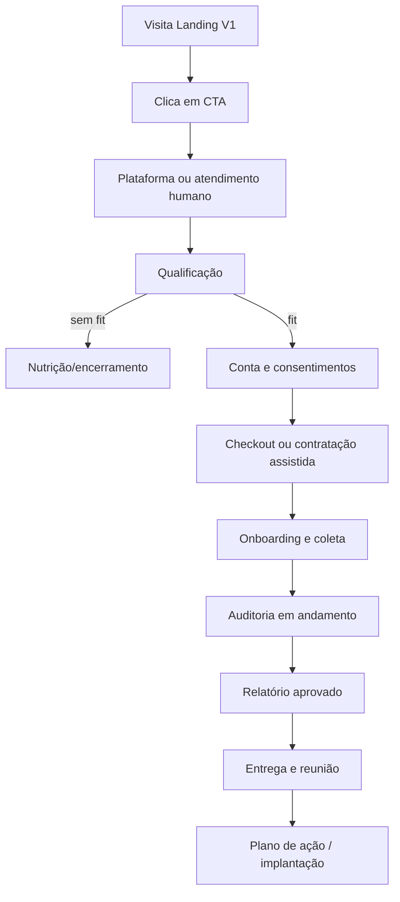
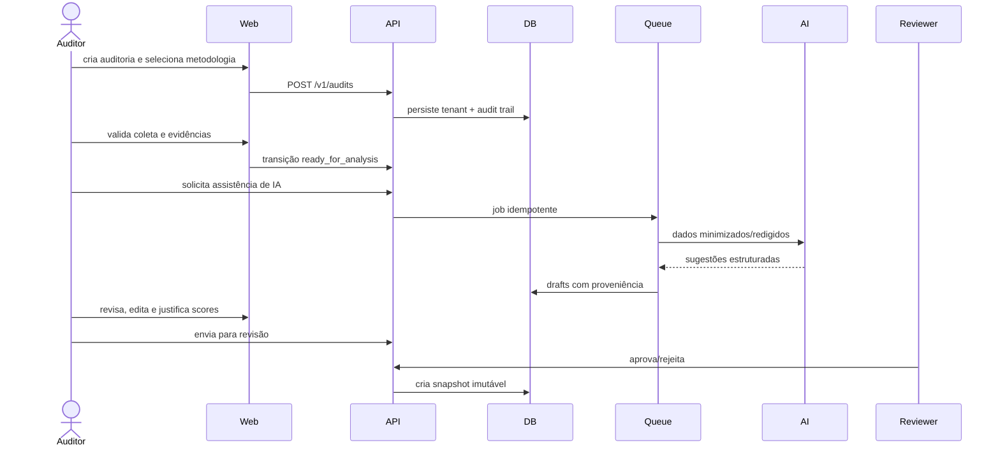
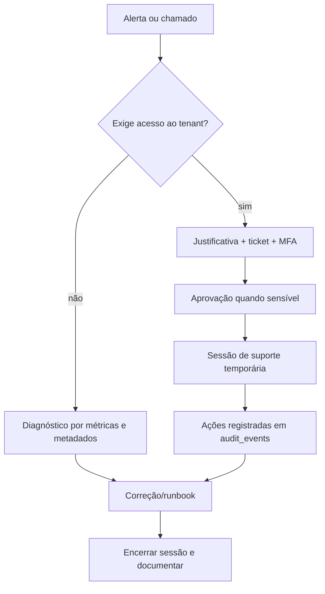
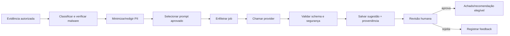
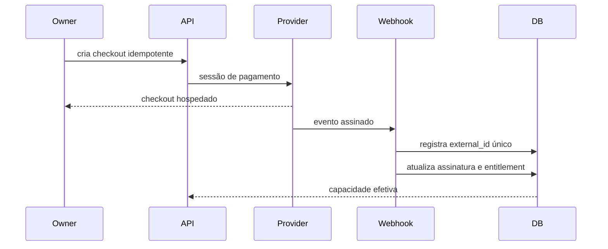

# Módulos e fluxos do RAIOX PLATFORM

## 1. Catálogo de módulos

| Módulo | Responsabilidade | Não faz |
|---|---|---|
| Identity | login, sessão, recuperação e MFA | autorização de negócio isoladamente |
| Tenancy & IAM | tenant, membership, convite, papel e entitlement | conteúdo de auditoria |
| CRM | lead, conta, contato e atividade | cobrança ou score |
| Methodology | nichos, dimensões, perguntas, pesos e versões | executar IA |
| Audit Workflow | ciclo, atribuição, SLA e transições | armazenar arquivo bruto |
| Evidence | fontes, uploads, classificação, acesso e retenção | decidir score |
| AI Orchestration | jobs, redaction, provider, validação e custo | aprovar/publicar resultado |
| Findings & Scoring | achados, scores, justificativas e revisão | renderizar PDF |
| Action Planning | recomendações, prioridades e plano | cobrança |
| Reporting | snapshot, aprovação, publicação e compartilhamento | editar metodologia publicada |
| Export | PDF e artefatos assíncronos | ser fonte transacional |
| Billing | planos, assinatura, uso e entitlement | guardar cartão |
| Notification | templates, preferências e entrega | ser sistema de registro comercial |
| Governance | consentimento, retenção, DSR e legal hold | aconselhamento jurídico automático |
| Audit Trail | eventos append-only e suporte justificado | logs de payload sensível |
| Platform Admin | tenants, saúde, suporte e feature flags | bypass silencioso de RLS |

## 2. Fluxo do usuário comprador

V2 mantém fallback humano. A landing só apontará para a plataforma depois do gate de segurança, legal e disponibilidade.

## 3. Fluxo do cliente auditado

1. Recebe convite de curta duração.
2. Confirma identidade e termos; configura MFA conforme risco.
3. Visualiza escopo, finalidade e checklist de dados.
4. Preenche respostas e envia evidências em bucket privado.
5. Acompanha completude, não notas preliminares.
6. Recebe aviso de publicação.
7. Acessa versão aprovada, exporta PDF e confirma recebimento.
8. Acompanha itens liberados do plano de ação.
9. Solicita correção, acesso ou exclusão pelo fluxo de privacidade.

## 4. Fluxo do auditor

## 5. Fluxo administrativo do tenant

- Criar tenant e completar dados contratuais.
- Convidar usuários com menor privilégio necessário.
- Definir auditores, revisores e responsáveis comerciais.
- Selecionar metodologia publicada permitida pelo plano.
- Acompanhar SLA, capacidade, consumo e custo de IA.
- Gerenciar preferências, integrações e retenção dentro de limites contratuais.
- Revogar acesso imediatamente e revisar memberships trimestralmente.
- Consultar trilha de ações do próprio tenant.

## 6. Fluxo administrativo da plataforma

Nenhum administrador usa usuário de cliente. Impersonação silenciosa é proibida. Acesso de suporte tem duração, escopo, motivo e trilha.

## 7. Fluxos de IA

### 7.1 Pipeline normativo

### 7.2 Casos permitidos por fase

| Caso | V2 | V3 | V4–V5 |
|---|---:|---:|---:|
| Classificação de evidência | protótipo interno | produção revisada | otimizada |
| Extração estruturada | não | assistida | ampliada |
| Sugestão de achados | não | assistida | por nicho |
| Sugestão de recomendação | não | assistida | benchmark controlado |
| Sugestão de score | não | somente proposta | calibrada por metodologia |
| Publicação autônoma | proibida | proibida | proibida sem nova aprovação de governança |
| Treino com dado de cliente | proibido por padrão | opt-in contratual separado | somente política aprovada |

### 7.3 Guardrails

- Allowlist de finalidades, modelos e prompts.
- Redação de PII antes do provider sempre que tecnicamente possível.
- Schema estrito; texto fora do contrato é rejeitado/quarentenado.
- Defesa contra prompt injection em conteúdo coletado.
- Limites de tokens, custo, timeout e concorrência por tenant.
- Sem acesso direto da IA ao banco, secrets ou ferramentas administrativas.
- Evidência citada em cada sugestão; ausência bloqueia aprovação.
- Avaliações de precisão, groundedness, viés, segurança e custo antes de promover versão.
- Kill switch global, por tenant, metodologia, provider e finalidade.
- Fallback manual preservado.

## 8. Fluxo de relatório

1. Auditoria chega a `awaiting_review` com evidências e justificativas completas.
2. Revisor confere achados, score, recomendações, linguagem e dados pessoais.
3. Aprovação gera `report_version` imutável com hash.
4. Renderização PDF entra em fila idempotente.
5. Export é armazenado em bucket privado e ligado à versão.
6. Publicação concede acesso ao cliente ou share token expirável.
7. Entrega e visualização geram eventos, sem pixel invasivo.
8. Correção gera versão seguinte e mantém cadeia `supersedes_id`.

## 9. Fluxo de pagamentos

O retorno do navegador não confirma pagamento. Somente webhook válido e reconciliado altera entitlement.

## 10. Fluxo LGPD

1. Receber solicitação e criar protocolo.
2. Verificar identidade sem coletar excesso.
3. Localizar dados por subject index autorizado.
4. Classificar direito, base legal e exceções.
5. Aprovar ação sensível por dupla checagem.
6. Exportar, corrigir, anonimizar ou excluir em todos os sistemas aplicáveis.
7. Notificar fornecedores quando necessário.
8. Registrar evidência de cumprimento sem preservar o dado excluído.
9. Encerrar dentro do prazo jurídico aprovado.

## 11. Eventos de domínio

| Evento | Consumidores esperados |
|---|---|
| `tenant.created` | onboarding, billing, audit trail |
| `member.invited` | notification, audit trail |
| `lead.qualified` | CRM, analytics |
| `audit.created` | workflow, entitlement, audit trail |
| `evidence.ready` | workflow, optional AI queue |
| `audit.review_requested` | notification, SLA |
| `finding.approved` | scoring, reporting |
| `report.approved` | export queue |
| `report.published` | notification, delivery tracking |
| `subscription.changed` | entitlements, notification |
| `privacy.requested` | governance, SLA, alert |

Eventos incluem `event_id`, `tenant_id`, `occurred_at`, `actor`, `schema_version`, `correlation_id` e referência do recurso; nunca o payload sensível completo.

## 12. Critérios de aceite dos fluxos

- Fluxos críticos têm estado, responsável, SLA, evento e trilha definidos.
- Toda etapa assíncrona suporta retry idempotente e dead-letter.
- Nenhuma saída de IA chega ao cliente sem revisão.
- Nenhuma confirmação de pagamento depende do redirect do navegador.
- Relatório publicado não é editável.
- Suporte privilegiado exige MFA, justificativa, expiração e log.
- Fluxo manual continua possível quando IA, pagamento ou mensageria falham.

