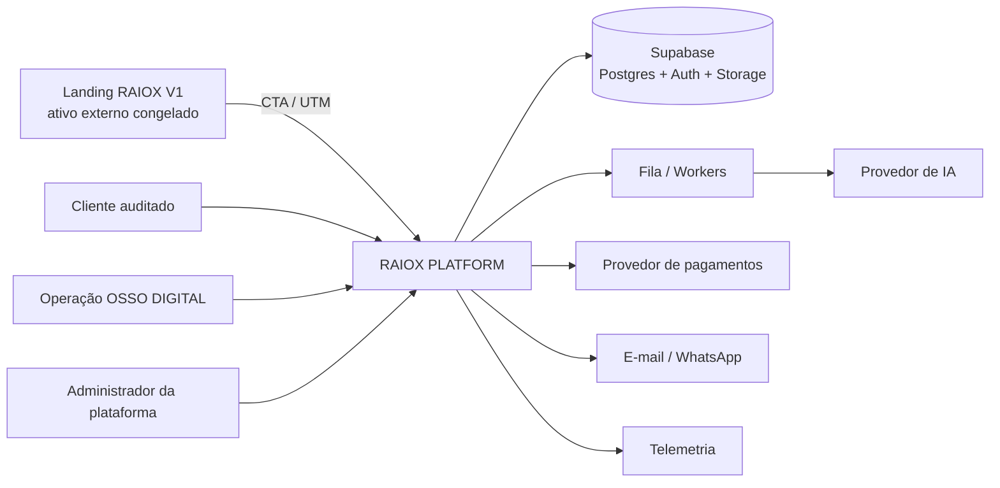
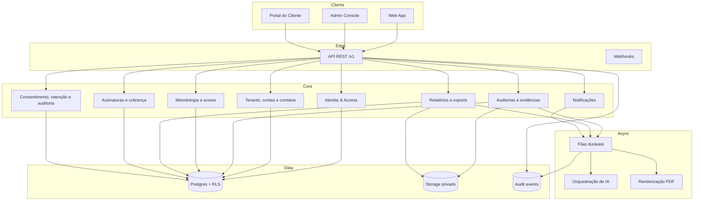
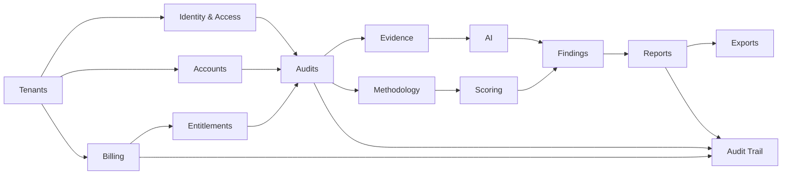

# MASTER PLAN — RAIOX PLATFORM (OSSO AUDIT)

**Missão:** 001 — Foundation  
**Status:** proposta arquitetural para aprovação  
**Data:** 01/07/2026  
**Baseline congelada da Landing V1:** commit `b7984a2`  
**Regra central:** a Landing RAIOX V1 é um ativo externo, publicado e congelado. A plataforma não copia, move, compila nem importa seus arquivos.

## 1. Decisão executiva

O RAIOX PLATFORM, nome de produto técnico **OSSO AUDIT**, será construído em repositório próprio (`ossodigital/raiox-platform`) como uma aplicação SaaS multiempresa. A landing atual continuará em `ossodigital/raiox-landing`, com domínio e ciclo de deploy independentes.

Nesta missão não há implementação de aplicação, migração SQL, função server-side, integração, automação ou lógica de score. Os documentos abaixo, complementados pelos ADRs da Missão 002, definem o contrato de construção da futura Missão 003.

## 2. Objetivos do produto

- Digitalizar a operação manual do RAIOX sem destruir o processo validado na V1.
- Isolar dados por empresa com `tenant_id` obrigatório e Row Level Security.
- Permitir auditorias humanas, assistidas por IA e revisadas antes da publicação.
- Gerar relatórios versionados, rastreáveis e exportáveis.
- Operar múltiplos nichos sem misturar critérios, benchmarks ou dados.
- Oferecer painel do cliente, painel operacional e administração da plataforma.
- Manter integrações e fornecedores substituíveis por contratos estáveis.

## 3. Não objetivos da Foundation

- Não alterar HTML, CSS, JavaScript, conteúdo, SEO ou deploy da Landing V1.
- Não implementar formulário, autenticação, Supabase, pagamentos ou IA.
- Não automatizar decisões comerciais nem publicar recomendações sem revisão humana.
- Não escolher prompts finais, pesos de score ou benchmarks sem validação metodológica.
- Não prometer conformidade jurídica automática; LGPD exige governança e revisão especializada.

## 4. Princípios arquiteturais

1. **Tenant first:** toda entidade de negócio pertence a um tenant e carrega `tenant_id NOT NULL`.
2. **RLS como última barreira:** autorização existe na interface e API, mas é garantida novamente no Postgres.
3. **API first:** clientes consomem REST versionado; o banco não é contrato de produto.
4. **Humano no controle:** IA propõe, o auditor revisa, o revisor aprova e somente então o relatório é publicado.
5. **Evidência antes de score:** nenhum achado ou nota existe sem fonte, justificativa e autoria.
6. **Imutabilidade de entrega:** relatório publicado vira snapshot; correções geram nova versão.
7. **Assíncrono por padrão para trabalho pesado:** ingestão, IA, PDF, webhooks e notificações usam filas e idempotência.
8. **Privacidade desde o desenho:** minimização, finalidade, retenção, consentimento quando aplicável e atendimento ao titular.
9. **Observabilidade sem vazamento:** logs estruturados nunca registram conteúdo sensível integral.
10. **Landing desacoplada:** integração apenas por URL, UTM e, futuramente, endpoint público controlado.

## 5. Arquitetura de contexto



## 6. Arquitetura lógica



## 7. Componentes de implantação

| Componente | Responsabilidade | Tecnologia-alvo | Escala |
|---|---|---|---|
| `apps/web` | Painel operacional e portal do cliente | Next.js + TypeScript | horizontal |
| `apps/api` | REST `/v1`, validação, autorização e orquestração | TypeScript em runtime edge | horizontal |
| `apps/worker` | IA, PDF, notificações e reconciliações | workers idempotentes | por fila |
| Supabase Auth | identidade, sessão, MFA | Supabase Auth | gerenciada |
| Supabase Postgres | fonte transacional e políticas RLS | PostgreSQL | vertical + pooling |
| Supabase Storage | evidências e relatórios privados | buckets com políticas | gerenciada |
| Supabase Queues | tarefas duráveis | `pgmq` | por fila |
| Telemetria | erros, traces, métricas e alertas | fornecedor substituível | independente |

Versões exatas serão fixadas por lockfile e ADR na Missão 003. A Foundation fixa capacidades e contratos, não versões voláteis.

## 8. Árvore definitiva do futuro repositório

```text
raiox-platform/
├── .github/
│   ├── CODEOWNERS
│   ├── dependabot.yml
│   ├── pull_request_template.md
│   └── workflows/
│       ├── ci.yml
│       ├── database.yml
│       ├── preview.yml
│       ├── release.yml
│       └── security.yml
├── apps/
│   ├── web/
│   │   ├── app/
│   │   │   ├── (auth)/
│   │   │   ├── (platform)/
│   │   │   ├── (tenant)/
│   │   │   ├── api/health/
│   │   │   ├── error.tsx
│   │   │   ├── layout.tsx
│   │   │   └── not-found.tsx
│   │   ├── components/
│   │   ├── features/
│   │   │   ├── accounts/
│   │   │   ├── audits/
│   │   │   ├── billing/
│   │   │   ├── reports/
│   │   │   ├── settings/
│   │   │   └── tenants/
│   │   ├── lib/
│   │   ├── public/
│   │   ├── tests/
│   │   └── package.json
│   ├── api/
│   │   ├── src/
│   │   │   ├── http/
│   │   │   │   ├── middleware/
│   │   │   │   ├── routes/v1/
│   │   │   │   └── schemas/
│   │   │   ├── modules/
│   │   │   │   ├── accounts/
│   │   │   │   ├── audits/
│   │   │   │   ├── authz/
│   │   │   │   ├── billing/
│   │   │   │   ├── evidence/
│   │   │   │   ├── reports/
│   │   │   │   ├── scoring/
│   │   │   │   └── tenants/
│   │   │   └── shared/
│   │   ├── tests/
│   │   └── package.json
│   └── worker/
│       ├── src/
│       │   ├── consumers/
│       │   ├── jobs/
│       │   ├── providers/
│       │   └── shared/
│       ├── tests/
│       └── package.json
├── packages/
│   ├── api-contracts/
│   ├── authz/
│   ├── config/
│   ├── database-types/
│   ├── domain/
│   ├── observability/
│   ├── test-kit/
│   ├── ui/
│   └── validation/
├── supabase/
│   ├── config.toml
│   ├── migrations/
│   ├── policies/
│   ├── seed/
│   ├── tests/
│   │   ├── pg_tap/
│   │   └── rls/
│   └── functions/
│       ├── api/
│       ├── webhooks/
│       └── _shared/
├── docs/
│   ├── adr/
│   ├── api/openapi-v1.yaml
│   ├── architecture/
│   ├── operations/
│   ├── product/
│   ├── runbooks/
│   ├── security/
│   └── testing/
├── tooling/
│   ├── eslint/
│   ├── scripts/
│   └── typescript/
├── .env.example
├── CHANGELOG.md
├── CONTRIBUTING.md
├── LICENSE
├── README.md
├── RELEASE_NOTES.md
├── ROADMAP.md
├── SECURITY.md
├── VERSION.md
├── package.json
├── pnpm-lock.yaml
├── pnpm-workspace.yaml
└── turbo.json
```

## 9. Dependências entre módulos



Regras: módulos não acessam tabelas de outro módulo diretamente; usam serviços/contratos internos. `domain` não depende de framework, UI, Supabase ou fornecedor de IA. Adaptadores dependem do domínio, nunca o inverso.

## 10. Documentos normativos da Foundation

- [Auditoria e reaproveitamento do V1](./V1_BASELINE_AUDIT.md)
- [Modelagem multiempresa](./DATA_MODEL.md)
- [Contratos REST v1](./API_CONTRACTS_V1.md)
- [Módulos e fluxos](./FLOWS_AND_MODULES.md)
- [Qualidade, segurança e operações](./QUALITY_SECURITY_OPERATIONS.md)
- [Backlog, comercial e cronograma](./BACKLOG_COMMERCIAL_ROADMAP.md)
- [Relatório executivo para aprovação](./EXECUTIVE_REPORT_FOUNDATION.md)

## 11. Gates para início da implementação

1. Aprovar separação dos repositórios e domínios.
2. Nomear controlador, operador, encarregado/canal LGPD e responsáveis de segurança.
3. Aprovar papéis, matriz de permissões e fluxo de revisão.
4. Aprovar metodologia de score e política de versionamento.
5. Escolher região, plano e política de backup do Supabase.
6. Escolher fornecedor de IA, pagamentos, e-mail e observabilidade mediante DPA e custo.
7. Aprovar retenção por classe de dado e procedimento de exclusão.
8. Definir limites comerciais e preços a validar.

## 12. Referências técnicas oficiais

- [Supabase Auth](https://supabase.com/docs/guides/auth)
- [Supabase Row Level Security](https://supabase.com/docs/guides/database/postgres/row-level-security)
- [Supabase Edge Functions](https://supabase.com/docs/guides/functions)
- [Supabase Queues](https://supabase.com/docs/guides/queues)
- [Supabase Auth Audit Logs](https://supabase.com/docs/guides/auth/audit-logs)
- [Supabase Vault](https://supabase.com/docs/guides/database/vault)
